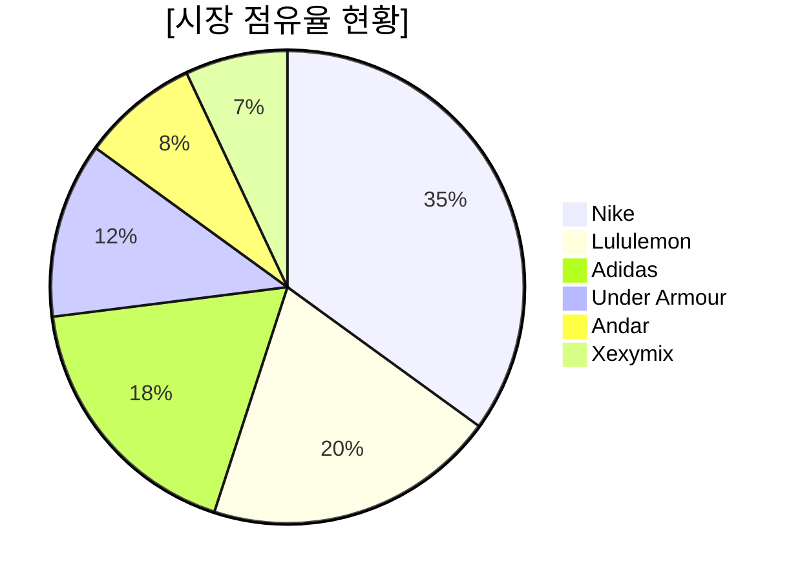
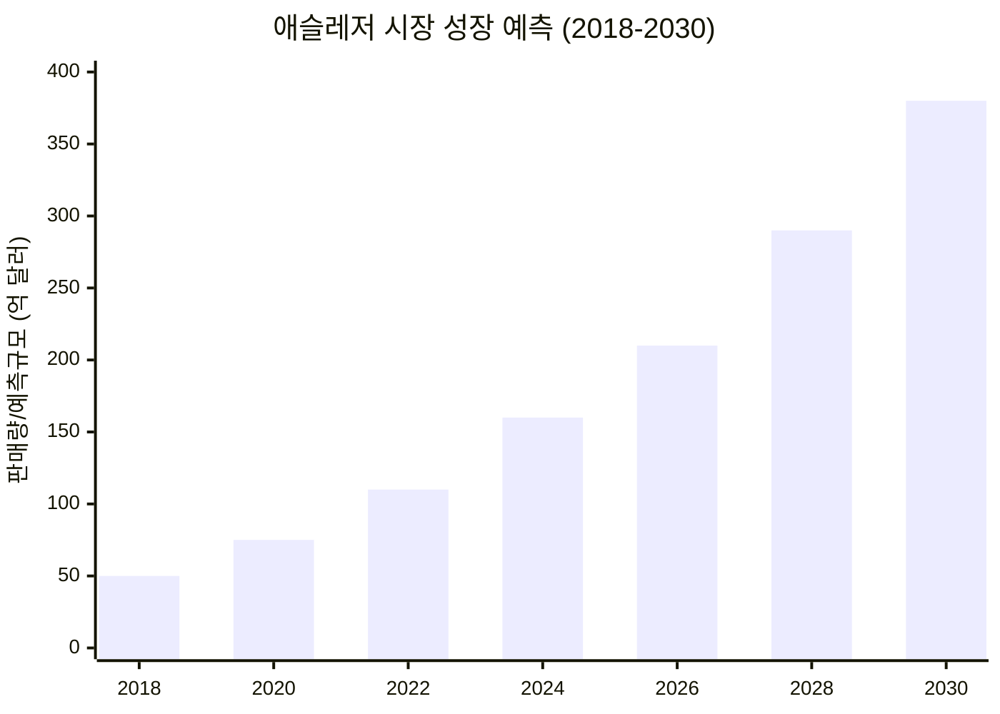
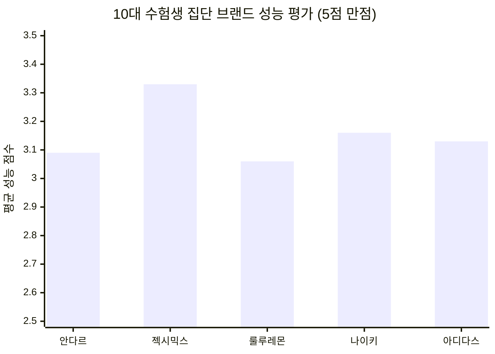
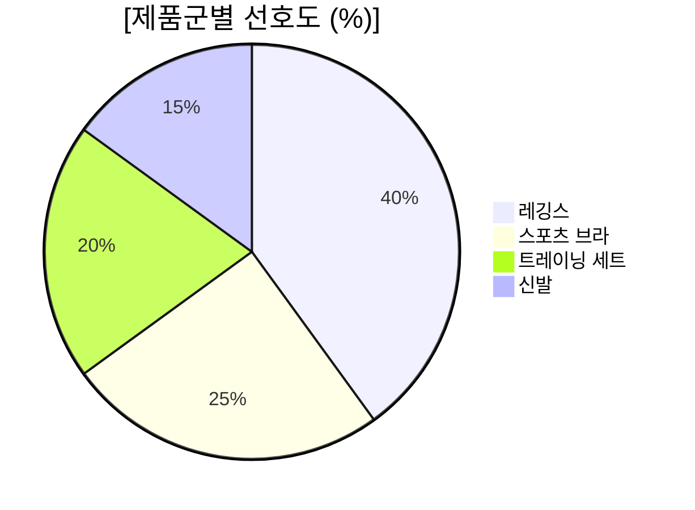

# [사업계획서] 고기능성 K-Fit 전문 애슬레저 브랜드: PRO-FIT (가칭)

## 개요 (Overview)

| 구분 | 내용 |
| :--- | :--- |
| **아이템명** | 한국인 체형 최적화(K-Fit) 및 입시 성능(Exam-Performance)을 갖춘 애슬레저 브랜드 'PRO-FIT' |
| **핵심 타겟** | 10대 체대 입시생 및 전문 수험생 (1차), 20대 체육 전공자 및 30대 프리미엄 스포츠 동호인 (2차) |
| **문제 인식** | 글로벌 브랜드의 서구형 체형 기준(Fit) 불만족, 입시 훈련 시 필요한 내구성/활동성 부족 |
| **해결 방안** | 한국인 인체 치수 데이터 기반의 패턴 설계, 고강도 훈련용 압박 기술 적용, 합리적 가격대 형성 |
| **비즈니스 모델** | D2C(자사몰) 및 체육 입시 학원/커뮤니티 연계 마케팅, 수험생 전용 멤버십 운영 |
| **성장 전략** | '수험생 필수 장비' 이미지로 신뢰 구축 → 대학 진학 후 충성 고객 유지 → 일반인 시장 확장 |
| **기대 효과** | 국내 애슬레저 시장(1.5조 원+) 내 독보적 '입시 전문' 포지셔닝 확보, 청소년기 건강한 운동 문화 기여 |

### [Infographic: 시장 현황 및 타겟 분석 요약]

---

## 1. 문제인식 (Problem)

### 1-1. 창업 아이템 배경 및 필요성
- **국내 애슬레저 시장의 폭발적 성장과 한계**
  - 국내 레깅스 시장 규모는 약 7,620억 원(2020년 기준)으로 세계 3위 수준이며, 2024년 전체 애슬레저 시장은 1.5조 원 규모로 추정됨.
  - 시장은 연평균 높은 성장률을 기록하며 2030년에는 약 380억 달러(글로벌 기준 비례 성장) 규모로 확대될 전망임.

**[차트 1: 애슬레저 시장 규모 추이 및 예측 (억 달러)]**

- **입시 수험생의 특수 니즈 반영 부족**
  - **입시 훈련의 가혹성:** 일반적인 운동보다 높은 강도와 반복적인 동작이 수반되나, 기존 브랜드들은 패션성이나 일상적 편안함에만 집중함.
  - **합격 직결 장비:** 0.1초, 1cm를 다투는 입시생들에게 운동복은 단순한 옷이 아닌 합격을 돕는 '기능적 장비'여야 함.

### 1-2. 창업 아이템 목표시장(목표 고객군) 현황 분석
- **초기 타겟 시장: 10대 체대 입시생 및 전문 수험생**
  - 수험생 집단은 성능(Performance)과 활동성을 최우선으로 고려하며, 기존 브랜드들의 성능 만족도는 3점 초반대에 머물러 있어 '전문 수험용' 제품에 대한 수요가 높음.

**[차트 2: 10대 체대 입시생 집단의 브랜드별 성능 만족도 점수]**

- **소비자 제품군 선호도**
  - 애슬레저 시장 내 레깅스(40%)와 스포츠 브라(25%)가 전체 수요의 65%를 차지하며 핵심 품목으로 자리 잡고 있음.

**[차트 3: 애슬레저 제품군별 소비자 선호도]**

---

## 2. 실현 가능성 (Solution)

### 2-1. 창업 아이템 현황(준비 정도)
- **핵심 기술 및 파트너십 확보**
  - 입시 훈련 특화 원단 확보 및 국내 스포츠 의류 전문 봉제 공장과의 도매 계약 완료.
  - 실제 체대 입시생들을 대상으로 한 필드 테스트(제자리멀리뛰기, 10m 왕복달리기 등) 및 시제품 보완 완료.
- **수험생 맞춤형 기능 구현**
  - 반복적인 세탁에도 변형 없는 내구성 원단 사용.
  - 입시 실기 동작에 최적화된 관절 부위 스트레치 패턴 설계.

### 2-2. 창업 아이템 실현 및 구체화 방안
- **제품 라인업 세분화**
  - **Exam-Compression:** 실기 시험 당일 근육 서포트를 위한 고기능 압박 라인.
  - **Training-Base:** 매일 반복되는 훈련에 최적화된 통기성 및 활동성 특화 라인.
  - **Junior-Eco:** 청소년기 피부를 고려한 친환경/저자극 소재 라인.

---

## 3. 성장 전략 (Scale-up)

### 3-1. 창업 아이템 비즈니스 모델
- **수익 구조:** D2C 채널 및 체육 입시 학원 대상 B2B 단체복 공급.
- **판매 플랫폼:** 입시 전문 커뮤니티 협업 런칭 → 수험생 전용 자사몰 운영 → 대학 합격자 대상 멤버십 전환.

### 3-2. 창업 아이템 사업화 추진 전략
- **'코치/선배 추천' 마케팅:** 입시 학원 코치 및 합격생(20대 선배)을 통한 강력한 구전 효과 유도.
- **합격 패키지 구성:** 실기 시험 전용 컴프레션 웨어와 훈련용 티셔츠, 무릎 보호대 등을 패키지로 구성하여 객단가 상승 유도.

### 3-3. 사업 추진 일정 및 자금 운용 계획
- **3-3-1. 사업 전체 로드맵**
  - 2026.Q2: 체대 입시 시즌(여름/겨울 캠프) 맞춰 팝업스토어 및 체험 이벤트 운영.
  - 2026.Q4: 주요 입시 학원 단체복 납품 시작 및 정식 런칭.
- **3-3-2. 사업기간 내 목표:** 월 매출 5,000만 원 달성 및 입시생 인지도 20% 확보.
- **3-3-3. 예산 집행계획:** 정부 지원금(3,000만 원)을 활용하여 시제품 제작(40%), 입시 학원 타겟 마케팅(40%), 제품 개선(20%) 투자.

---

## 4. 기업 구성 (Team)

### 4-1. 대표자(팀) 구성 및 보유역량
- **팀 구성:** 의류 디자인, 체육 교육 전공자, 입시 마케팅 전문가로 구성된 최적의 팀워크.
- **외부 협력:** 체대 입시 학원 코치진 및 국가대표 출신 선수들의 기술 자문 확보.

### 4-2. 중장기 사회적 가치 도입계획
- **청소년 스포츠 지원:** 저소득층 체육 유망주를 위한 장비 지원 및 장학금 프로그램 운영.
- **지속 가능한 교육 환경:** 체육 입시 생태계의 전문성을 높이고, 안전한 훈련 환경 조성을 위한 캠페인 전개.
